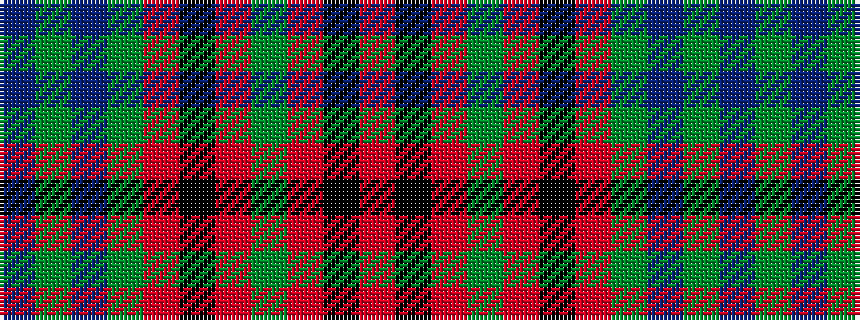

BGBGRKRGRKR

It is a 11 stripe tartan.

<figure class="pat-woven">

<figcaption>idealised sample</figcaption>
</figure>

## Colour Sequence



## Tartans with this colour sequence

| Tartans |
|---------------|
| [Hueg (Personal)](/setts/s11/r10k10r4g2r2k2r4g12dt12g3dt4~x2/)|
||
