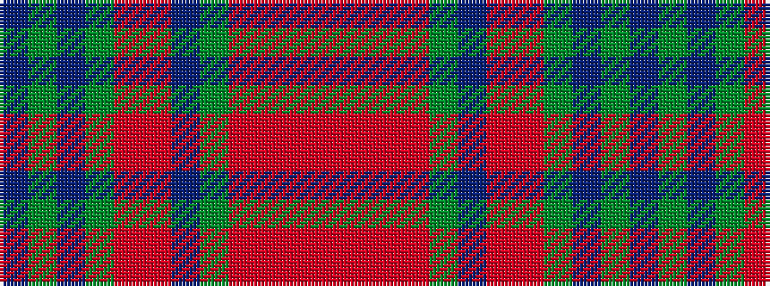

BGBGRRBGRRRR

It is a 12 stripe tartan.

<figure class="pat-woven">

<figcaption>idealised sample</figcaption>
</figure>

## Colour Sequence



## Tartans with this colour sequence

| Tartans |
|---------------|
| [Strathgaela (Corporate)](/setts/s12/dp3dg3db3dg11o8m8db4dg3m3r3m15r3~x2/)|
||
