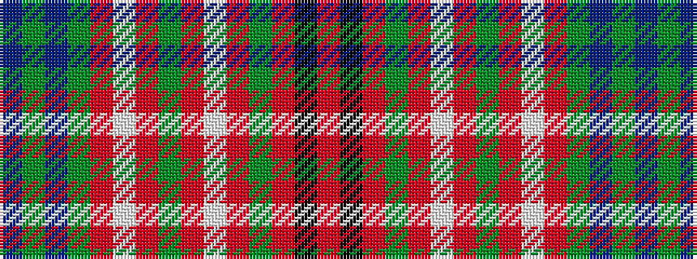

BGBGRWRGRWRGRKR

It is a 15 stripe tartan.

<figure class="pat-woven">

<figcaption>idealised sample</figcaption>
</figure>

## Colour Sequence



## Tartans with this colour sequence

| Tartans |
|---------------|
| [MacCall Family Tartan](/variants/s15/r6k4r8g16r6lb2r2g2r2lb2r6g18dp6g2dp1~x2/)|
||
