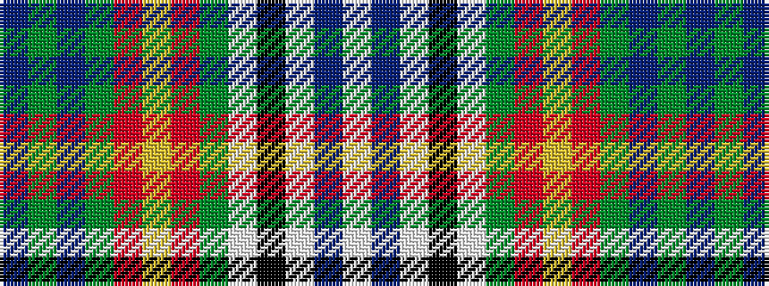

BGBGRYRGWKWBW

It is a 13 stripe tartan.

<figure class="pat-woven">

<figcaption>idealised sample</figcaption>
</figure>

## Colour Sequence



## Tartans with this colour sequence

| Tartans |
|---------------|
| [Gordon dress #5](/variants/s13/w6db3w18k5w5dy10o17ly4o17dy10t10dy2t4~x2/)|
||
