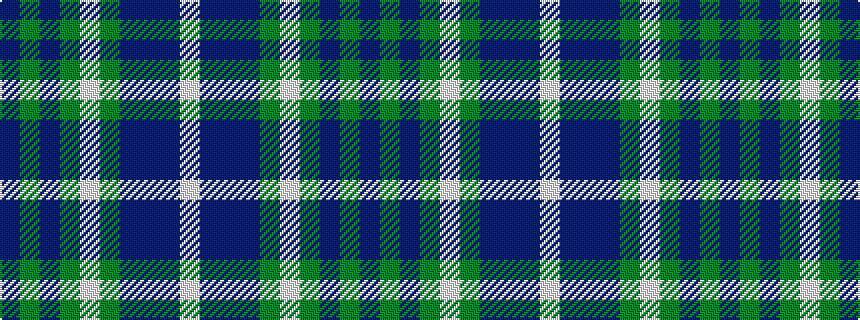

BGBGWGBBBW

It is a 10 stripe tartan.

<figure class="pat-woven">

<figcaption>idealised sample</figcaption>
</figure>

## Colour Sequence



## Tartans with this colour sequence

| Tartans |
|---------------|
| [State Seal of Connecticut (Fashion)](/variants/s10/dp4g6dt4g28lb4g6dt6db46dt1lb4~x2/)|
||
