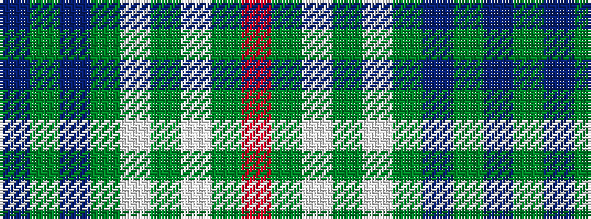

BGBGWGWGR

It is a 9 stripe tartan.

<figure class="pat-woven">

<figcaption>idealised sample</figcaption>
</figure>

## Colour Sequence



## Tartans with this colour sequence

| Tartans |
|---------------|
| [Todd Family Tartan Tartan Number: 5107. Earliest known date: 2000 Variation of Tweedside Green Hunting with the black pivot changed to red. Produced for Gregory V Todd and registered with TECA 10th August 1996. Anyone of the name can wear io. D C Dalgliesh was the weaver. Todd is Border dialect for fox - hence the red. See products available Copyright © Blair Urquhart, Comrie, 2015](/setts/s9/db28g3dp3g8w3g3w3g3r3~x2/)|
||
