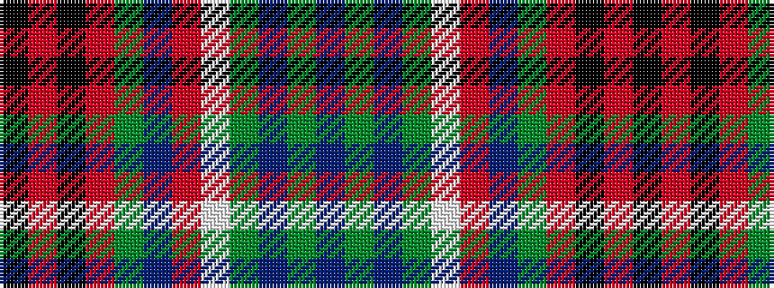

BGBGWRBGRKRK

It is a 12 stripe tartan.

<figure class="pat-woven">

<figcaption>idealised sample</figcaption>
</figure>

## Colour Sequence



## Tartans with this colour sequence

| Tartans |
|---------------|
| [Glengaela (Fashion)](/variants/s12/dp3g3db3dg2lb8r8db4dg3r3k3r15k2~x2/)|
||
