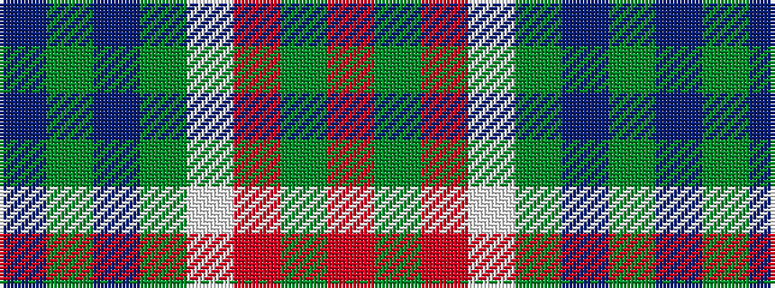

BGBGWRGR

It is a 8 stripe tartan.

<figure class="pat-woven">

<figcaption>idealised sample</figcaption>
</figure>

## Colour Sequence



## Tartans with this colour sequence

| Tartans |
|---------------|
| [Bannock Bane M.407](/variants/s8/db4dy3db21dy2w14o22dy3o4~x2/)|
||
