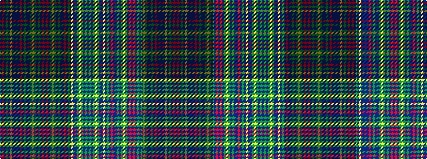

BGBGYGBBYBGBRBBGBGYGBRBRBGBGYGBBGBRBBBBYBGBRB

It is a 45 stripe tartan.

<figure class="pat-woven">

<figcaption>idealised sample</figcaption>
</figure>

## Colour Sequence



## Tartans with this colour sequence

| Tartans |
|---------------|
| [Highland Mist](/setts/s45/dt2g3dp1g2lo1g2dti2dp1lo2dp3g1dp2r1dp2dt2g3dp1g2lo1g2dti2r1dt2r1dt30g3dp1g2lo1g2dti1dp2g1dp2r1dp2dt2dti28dp1lo2dp3g1dp2r1dp2~x2/)|
||
