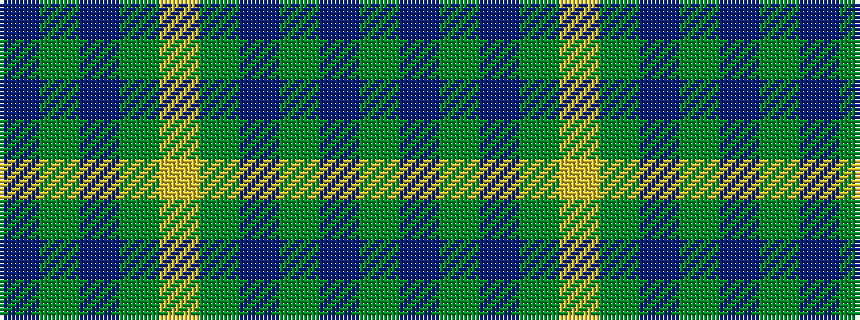

BGBGYGBGBG

It is a 10 stripe tartan.

<figure class="pat-woven">

<figcaption>idealised sample</figcaption>
</figure>

## Colour Sequence



## Tartans with this colour sequence

| Tartans |
|---------------|
| [Oman, Sultanate of / Oliver dress](/variants/s10/dy9t3dy6t3dy20ly2~x2/)|
||
