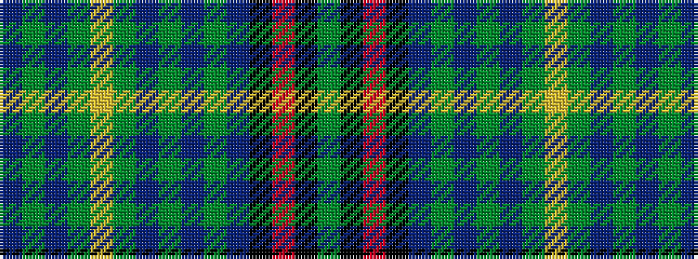

BGBGYGBGBGBKRKG

It is a 15 stripe tartan.

<figure class="pat-woven">

<figcaption>idealised sample</figcaption>
</figure>

## Colour Sequence



## Tartans with this colour sequence

| Tartans |
|---------------|
| [Ontario Ensign of.. District Tartan](/variants/s15/dg24k1r5k1do20dg4do4dg4do21dg4ly5dg24do4dg4do4~x2/)|
||
