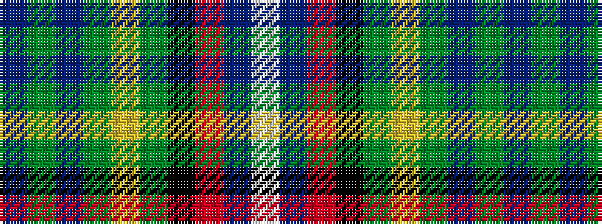

BGBGYGKRBW

It is a 10 stripe tartan.

<figure class="pat-woven">

<figcaption>idealised sample</figcaption>
</figure>

## Colour Sequence



## Tartans with this colour sequence

| Tartans |
|---------------|
| [EAIE 2015](/setts/s10/b4g1b2g2lr6g2k3r1b8w1~x2/)|
||
