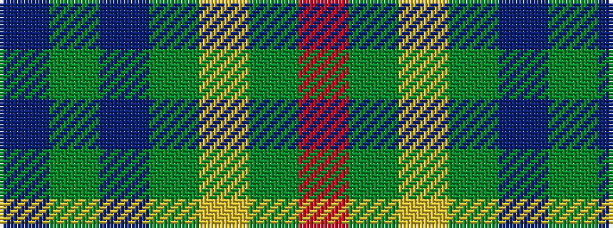

BGBGYGR

It is a 7 stripe tartan.

<figure class="pat-woven">

<figcaption>idealised sample</figcaption>
</figure>

## Colour Sequence



## Tartans with this colour sequence

| Tartans |
|---------------|
| [Greenways Marketing Intl (Corporate)](/setts/s7/db24g3db3g3lo2g18r2~x2/)|
||
| [St Andrews Links](/setts/s7/dt16g4dt3g3lo2g24r2~x2/)|
||
| [St Andrews Links](/setts/s7/db26g4db3g3ly2g24r2~x2/)|
||
