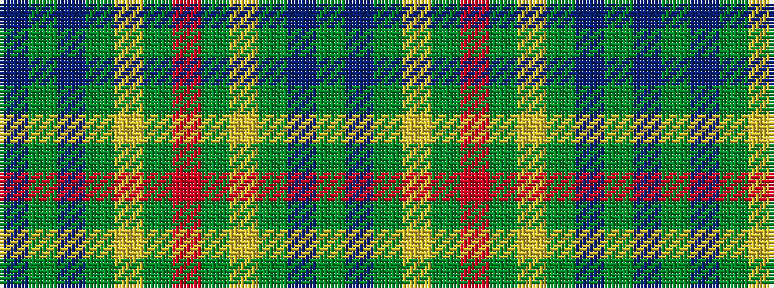

BGBGYGRGYGBG

It is a 12 stripe tartan.

<figure class="pat-woven">

<figcaption>idealised sample</figcaption>
</figure>

## Colour Sequence



## Tartans with this colour sequence

| Tartans |
|---------------|
| [St Andrews Links Corporate Tartan Tartan Number: 2391. Earliest known date: May 1997 Designed by Polly Wittering of the House of Edgar 1997. Corporate tartan for use on merchandise. Green lightened here to show the sett. See products available Copyright © Blair Urquhart, Comrie, 2015](/setts/s12/dt16g4dt3g3lo2g24r2~x2/)|
||
