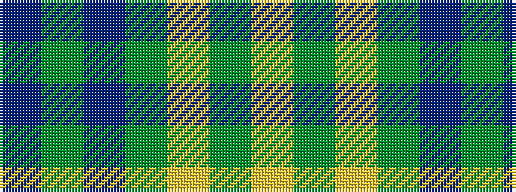

BGBGYGY

It is a 7 stripe tartan.

<figure class="pat-woven">

<figcaption>idealised sample</figcaption>
</figure>

## Colour Sequence



## Tartans with this colour sequence

| Tartans |
|---------------|
| [Bannockbane Brown #2](/variants/s7/db3y2db30y19lo14y2lo3~x2/)|
||
