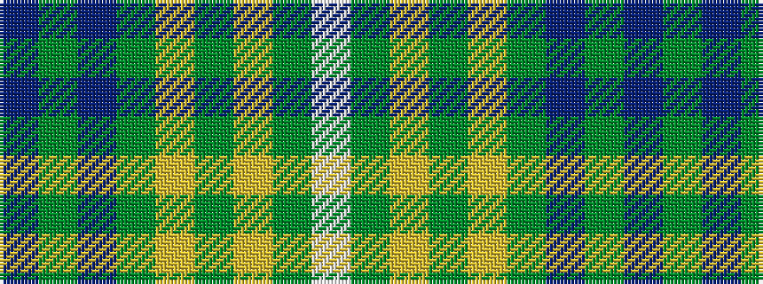

BGBGYGYGW

It is a 9 stripe tartan.

<figure class="pat-woven">

<figcaption>idealised sample</figcaption>
</figure>

## Colour Sequence



## Tartans with this colour sequence

| Tartans |
|---------------|
| [Titanium](/setts/s9/dt44y8dt8y22lr4y4lr11y2w2~x2/)|
||
