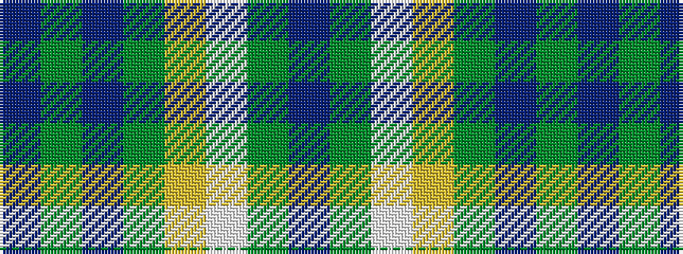

BGBGYWGB

It is a 8 stripe tartan.

<figure class="pat-woven">

<figcaption>idealised sample</figcaption>
</figure>

## Colour Sequence



## Tartans with this colour sequence

| Tartans |
|---------------|
| [St. Columba (one green)](/setts/s8/db20y1w1lo3g14n4y1dp4~x2/)|
||
