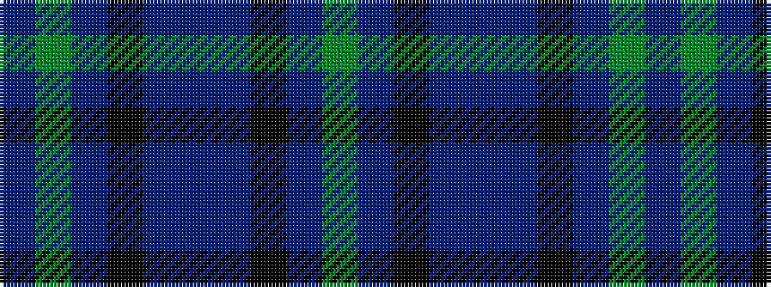

BGBKBBBKBG

It is a 10 stripe tartan.

<figure class="pat-woven">

<figcaption>idealised sample</figcaption>
</figure>

## Colour Sequence



## Tartans with this colour sequence

| Tartans |
|---------------|
| [Notre Dame Marching Guard](/variants/s10/g9b9k24b35dr5b35k24b9g9dr5~x2/)|
||
