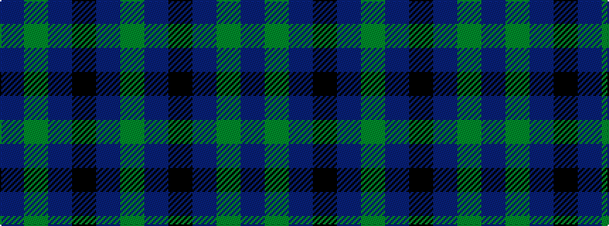

BGBKBG

It is a 6 stripe tartan.

<figure class="pat-woven">

<figcaption>idealised sample</figcaption>
</figure>

## Colour Sequence



## Tartans with this colour sequence

This pattern is a design lineage: every tartan below shares one colour order, whatever its owner —
near-identical designs are grouped, the largest lineage first (#112: the pattern is a tartan's
second parent, beside its family or clan).

<table class="sett-table">
<tbody>
<tr><td><a href="/variants/s6/g50db20k3db2dy2db5~x2/">St Andrews Old Course Hotel Corporate Tartan</a></td></tr>
<tr><td class="sett-swatch"></td></tr>
<tr><td><a href="/variants/s6/g45db14k3db2dy2db5~x2/">St Andrews Old Course Hotel, Golf Course and Spa</a></td></tr>
<tr><td class="sett-swatch"></td></tr>
<tr><td><a href="/variants/s6/g26db10k3db2dy2db10~x4/">St. Andrews Old Course Hotel (Corp)</a></td></tr>
<tr><td class="sett-swatch"></td></tr>
<tr class="cluster-sep"><td></td></tr>
<tr><td><a href="/variants/s6/dr8g2dr2k1dr1g2~x10/">Waverley Care Aids Trust (Corporate)</a></td></tr>
<tr><td class="sett-swatch"></td></tr>
</tbody>
</table>

