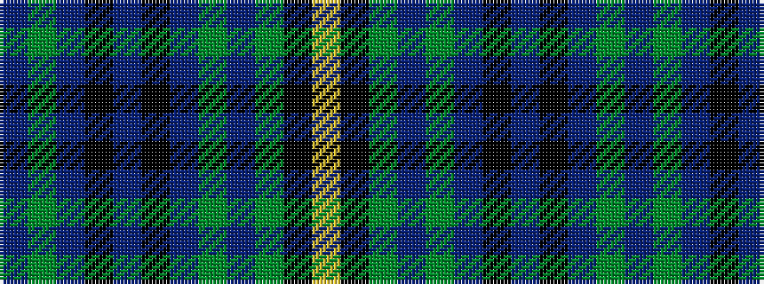

BGBKBKBGBGKY

It is a 12 stripe tartan.

<figure class="pat-woven">

<figcaption>idealised sample</figcaption>
</figure>

## Colour Sequence



## Tartans with this colour sequence

| Tartans |
|---------------|
| [Moon (New Maldon, Surrey)](/variants/s12/db6dg3db24k2db4k16db5dg2db23dg2k2ly2~x2/)|
||
