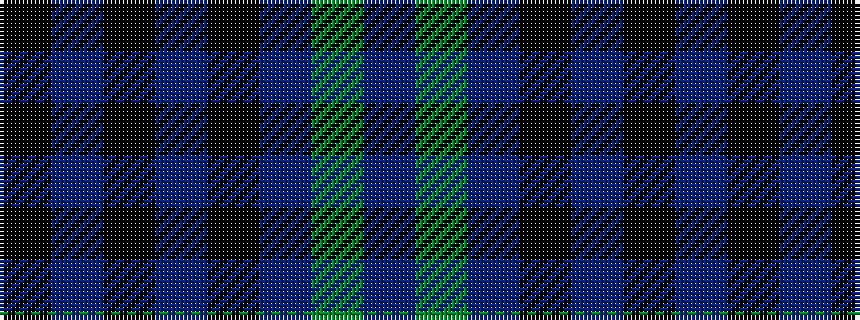

BGBKBKBK

It is a 8 stripe tartan.

<figure class="pat-woven">

<figcaption>idealised sample</figcaption>
</figure>

## Colour Sequence



## Tartans with this colour sequence

| Tartans |
|---------------|
| [Martin's Own](/setts/s8/k10t1k2t1k4t10g1t2~x4/)|
||
