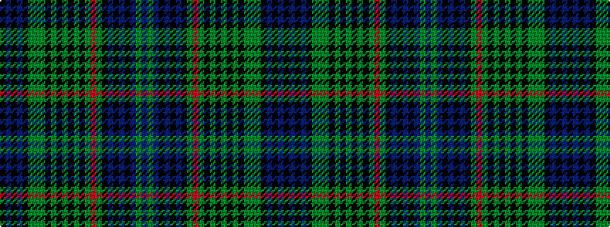

BGBKBKBKGRGKGKGKGKGGGKBKBK

It is a 26 stripe tartan.

<figure class="pat-woven">

<figcaption>idealised sample</figcaption>
</figure>

## Colour Sequence



## Tartans with this colour sequence

This pattern is a design lineage: every tartan below shares one colour order, whatever its owner —
near-identical designs are grouped, the largest lineage first (#112: the pattern is a tartan's
second parent, beside its family or clan).

<table class="sett-table">
<tbody>
<tr><td><a href="/setts/db9dg4db9k3db3k3db3k8dg27r4dg27k8dg5k13dg4k13dg5k8dg27y4dg27k8db3k3db3k3/">Stewart Hunting</a></td></tr>
<tr><td class="sett-swatch"></td></tr>
<tr><td><a href="/variants/s26/db8g2db8k2db2k2db2k4g11r2g11k4g2k9g2k9g2k4g11y2g11k4db2k2db2k4~x2/">Stuart/Stewart Hunting #3</a></td></tr>
<tr><td class="sett-swatch"></td></tr>
</tbody>
</table>

