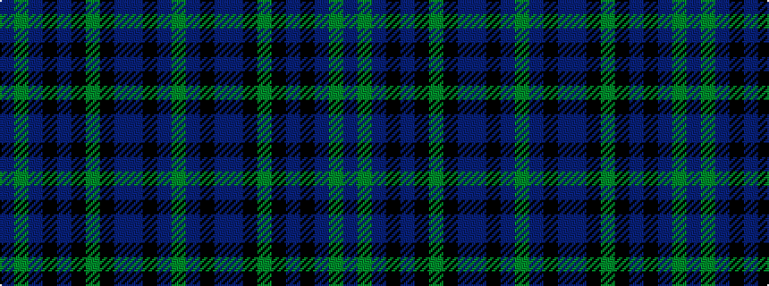

BGBKBKGKBBKBG

It is a 13 stripe tartan.

<figure class="pat-woven">

<figcaption>idealised sample</figcaption>
</figure>

## Colour Sequence



## Tartans with this colour sequence

| Tartans |
|---------------|
| [Berwick (Fashion)](/variants/s13/do24g5n2k14dr2k3g3k3n14do6k4do3g2~x2/)|
||
