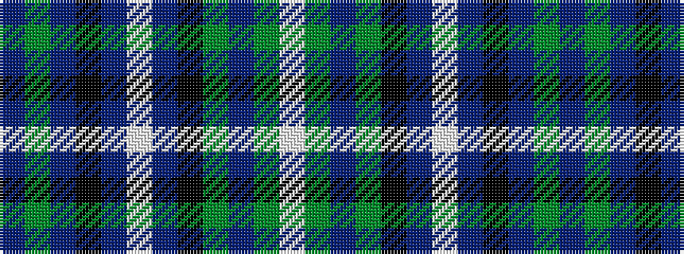

BGBKBWBKGBGW

It is a 12 stripe tartan.

<figure class="pat-woven">

<figcaption>idealised sample</figcaption>
</figure>

## Colour Sequence



## Tartans with this colour sequence

| Tartans |
|---------------|
| [Unidentified #48](/setts/s12/db30g3db4k2db2lb2db2k14g8db2g6lb2~x2/)|
||
