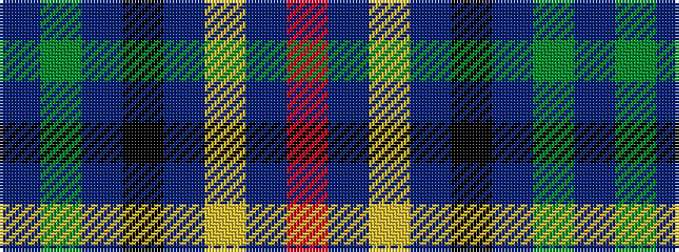

BGBKBYBR

It is a 8 stripe tartan.

<figure class="pat-woven">

<figcaption>idealised sample</figcaption>
</figure>

## Colour Sequence



## Tartans with this colour sequence

| Tartans |
|---------------|
| [Lapsley, The Tom](/setts/s8/db35g10t10k10db23ly1db3r2~x2/)|
||
| [Lapsley, The Tom (Personal)](/setts/s8/db35g10t10k10db23lo1db3r2~x2/)|
||
