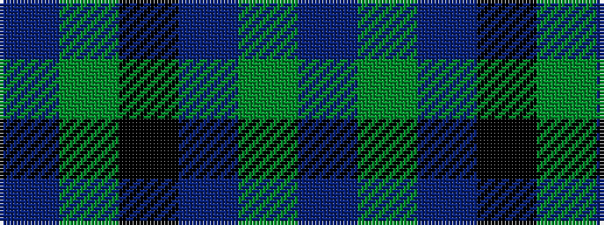

BGBKGB

It is a 6 stripe tartan.

<figure class="pat-woven">

<figcaption>idealised sample</figcaption>
</figure>

## Colour Sequence



## Tartans with this colour sequence

| Tartans |
|---------------|
| [Unidentified (Kallmeyer 'B')](/variants/s6/b48g2b7k24g26b4~x2/)|
||
