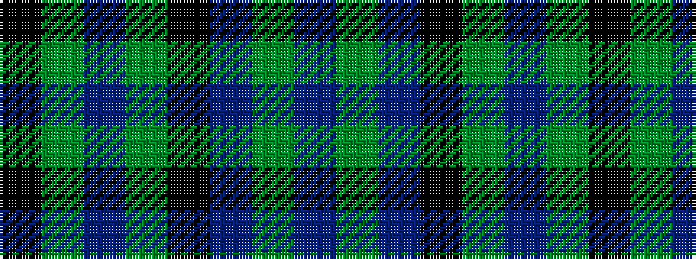

BGBKGBGK

It is a 8 stripe tartan.

<figure class="pat-woven">

<figcaption>idealised sample</figcaption>
</figure>

## Colour Sequence



## Tartans with this colour sequence

| Tartans |
|---------------|
| [Finnie (Personal)](/setts/s8/k4y1dp5y1k20db37y4db4~x2/)|
||
