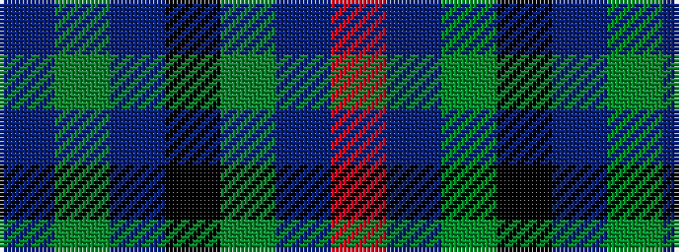

BGBKGBR

It is a 7 stripe tartan.

<figure class="pat-woven">

<figcaption>idealised sample</figcaption>
</figure>

## Colour Sequence



## Tartans with this colour sequence

| Tartans |
|---------------|
| [Royal British Legion, The](/setts/s7/r6b2g20k3db8g2b4~x2/)|
||
