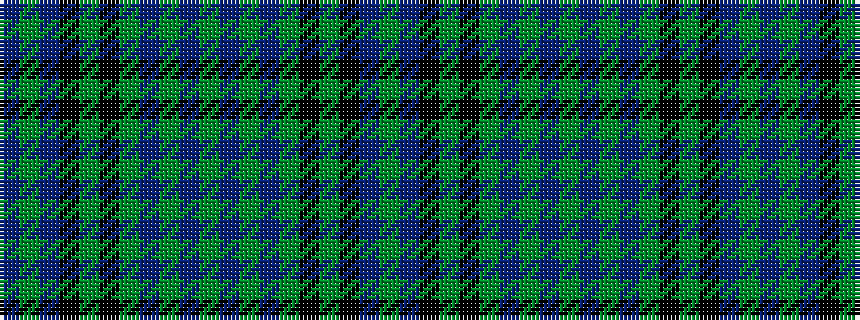

BGBKGKGBGBGBGBGKGKBG

It is a 20 stripe tartan.

<figure class="pat-woven">

<figcaption>idealised sample</figcaption>
</figure>

## Colour Sequence



## Tartans with this colour sequence

| Tartans |
|---------------|
| [Cargill Clan/Family Tartan Tartan Number: 3132. Earliest known date: 1880 Known more commonly as Clergy or Beachan na Clerich this tartan is also known as Cargill, as it appears in the Clans Originaux, 1880 See products available Copyright © Blair Urquhart, Comrie, 2015](/setts/s20/db1g1db6k6g1k6g1db2g1db3g1db3g1db2g1k6g1k6db6g1~x4/)|
||
