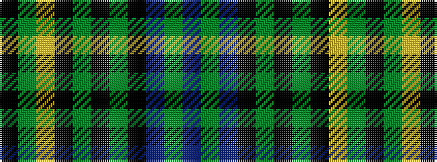

BGBKGKGKYGK

It is a 11 stripe tartan.

<figure class="pat-woven">

<figcaption>idealised sample</figcaption>
</figure>

## Colour Sequence



## Tartans with this colour sequence

| Tartans |
|---------------|
| [Sturm (2016)](/variants/s11/k12y3lo2k2y3k18dy4k2dp18y2db2~x2/)|
||
