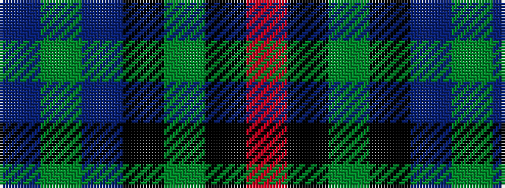

BGBKGKR

It is a 7 stripe tartan.

<figure class="pat-woven">

<figcaption>idealised sample</figcaption>
</figure>

## Colour Sequence



## Tartans with this colour sequence

| Tartans |
|---------------|
| [McEwan '1856', The](/setts/s7/db2dy3db16k18g18k2r2~x2/)|
||
