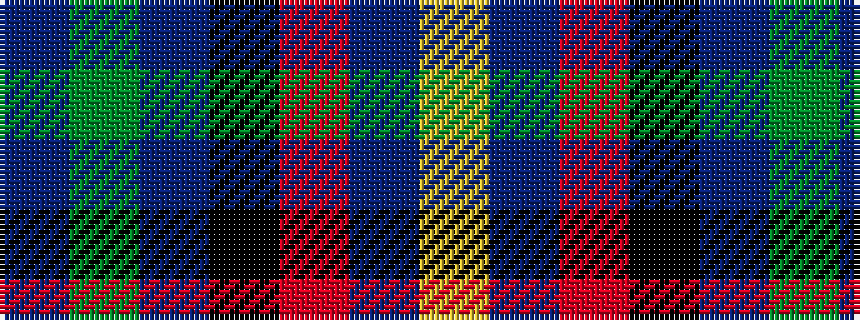

BGBKRBY

It is a 7 stripe tartan.

<figure class="pat-woven">

<figcaption>idealised sample</figcaption>
</figure>

## Colour Sequence



## Tartans with this colour sequence

| Tartans |
|---------------|
| [Spirit of South Lanarkshire (Distric](/setts/s7/t13g2t12k8r1dt35lo1~x2/)|
||
