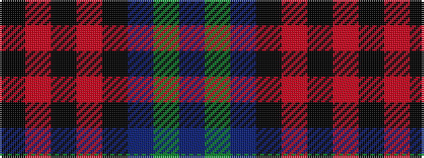

BGBKRKRK

It is a 8 stripe tartan.

<figure class="pat-woven">

<figcaption>idealised sample</figcaption>
</figure>

## Colour Sequence



## Tartans with this colour sequence

| Tartans |
|---------------|
| [Home (Clan)](/variants/s8/k36r3k3r3k9b36g3b2~x2/)|
||
| [Home or Hume (Vestiarium Scoticum)](/variants/s8/k28r1k2r1k8db24dg2db3~x2/)|
||
| [Home, or Hume](/variants/s8/k28r1k2r1k8db24g2db3~x2/)|
||
