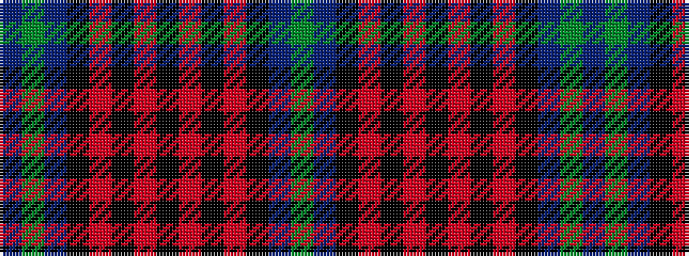

BGBKRKRKRKRKBG

It is a 14 stripe tartan.

<figure class="pat-woven">

<figcaption>idealised sample</figcaption>
</figure>

## Colour Sequence



## Tartans with this colour sequence

| Tartans |
|---------------|
| [Home (Clans Originaux)](/setts/s14/g3b36k9r3k3r3k36r3k3r3k9b36g3b2~x2/)|
||
