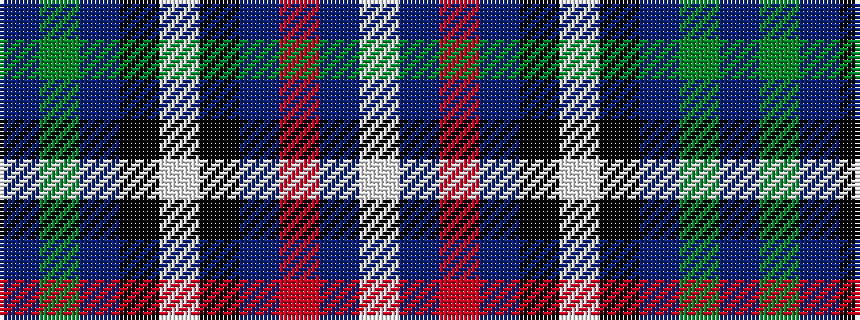

BGBKWKBRBW

It is a 10 stripe tartan.

<figure class="pat-woven">

<figcaption>idealised sample</figcaption>
</figure>

## Colour Sequence



## Tartans with this colour sequence

| Tartans |
|---------------|
| [Al-Fadhli (Personal)](/setts/s10/db3dg3db24k34w1k34db24r3db3w3~x2/)|
||
