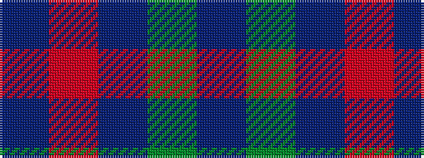

BGBRB

It is a 5 stripe tartan.

<figure class="pat-woven">

<figcaption>idealised sample</figcaption>
</figure>

## Colour Sequence



## Tartans with this colour sequence

| Tartans |
|---------------|
| [Lloyd (Welsh Name)](/variants/s5/dt40o2dt20g19db2/)|
||
| [Wyeth (Personal)](/variants/s5/db18r18dp2g12db1~x4/)|
||
