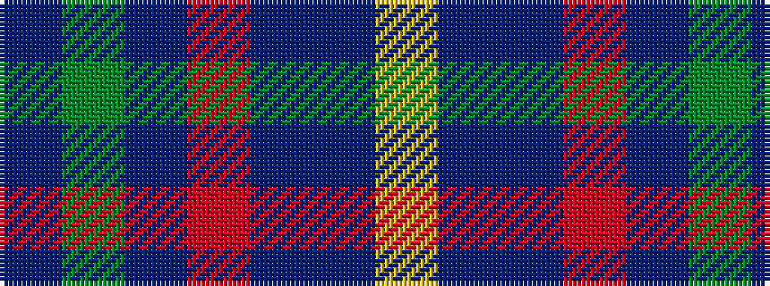

BGBRBBY

It is a 7 stripe tartan.

<figure class="pat-woven">

<figcaption>idealised sample</figcaption>
</figure>

## Colour Sequence



## Tartans with this colour sequence

| Tartans |
|---------------|
| [Heckenberg Htg (Personal)](/setts/s7/db3g13t1r3t1db10ly1~x2/)|
||
