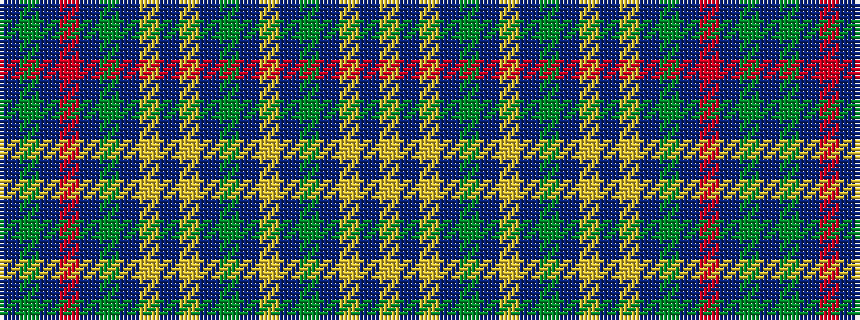

BGBRBGBYBYBGBYBGBYBY

It is a 20 stripe tartan.

<figure class="pat-woven">

<figcaption>idealised sample</figcaption>
</figure>

## Colour Sequence



## Tartans with this colour sequence

| Tartans |
|---------------|
| [Smith of Pennylands](/setts/s20/dt30g30dt2r7dt2g30dt30lg30b7lg30dt30g30dt2ly7dt2g30dt30lg30b7lg30~x2/)|
||
