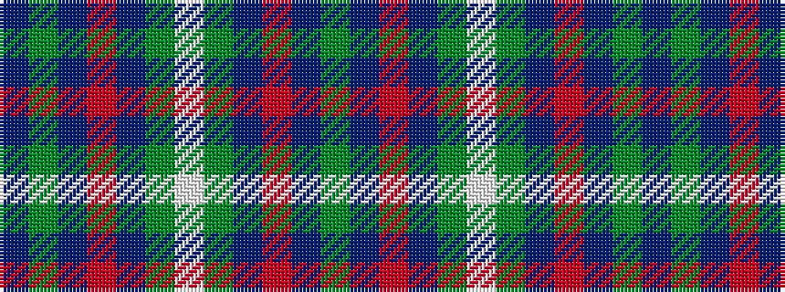

BGBRBGWGBRBG

It is a 12 stripe tartan.

<figure class="pat-woven">

<figcaption>idealised sample</figcaption>
</figure>

## Colour Sequence



## Tartans with this colour sequence

| Tartans |
|---------------|
| [Unidentified (1996)](/setts/s12/g2db1r16db12g16w1g16db12r16db1g2db1~x2/)|
||
