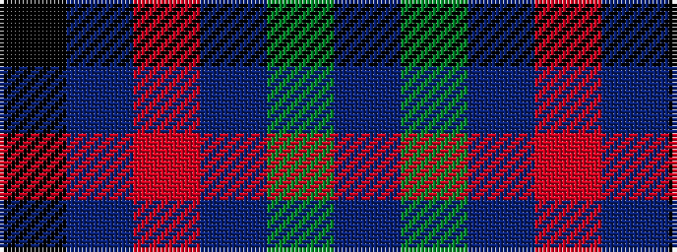

BGBRBK

It is a 6 stripe tartan.

<figure class="pat-woven">

<figcaption>idealised sample</figcaption>
</figure>

## Colour Sequence



## Tartans with this colour sequence

| Tartans |
|---------------|
| [Antonello (Personal)](/setts/s6/k1t1r1db1g1db1~x24/)|
||
