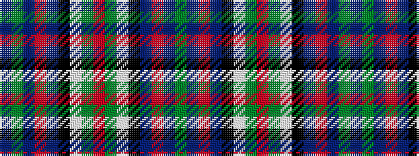

BGBRBKWGRGWKBRBG

It is a 16 stripe tartan.

<figure class="pat-woven">

<figcaption>idealised sample</figcaption>
</figure>

## Colour Sequence



## Tartans with this colour sequence

| Tartans |
|---------------|
| [Wilson's No.033 #2](/variants/s16/g17t3r3t3k19w2g17r4g17w2k19t3r3t3g17db8~x2/)|
||
