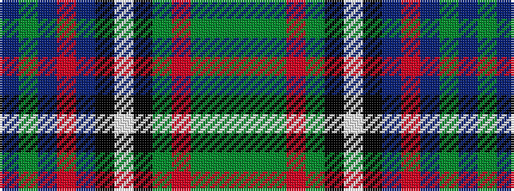

BGBRBKWKGRGGG

It is a 13 stripe tartan.

<figure class="pat-woven">

<figcaption>idealised sample</figcaption>
</figure>

## Colour Sequence



## Tartans with this colour sequence

| Tartans |
|---------------|
| [Redgate (Name)](/variants/s13/t21dy10t18r6t18k20lb2k20g12r6g12dy8g2/)|
||
