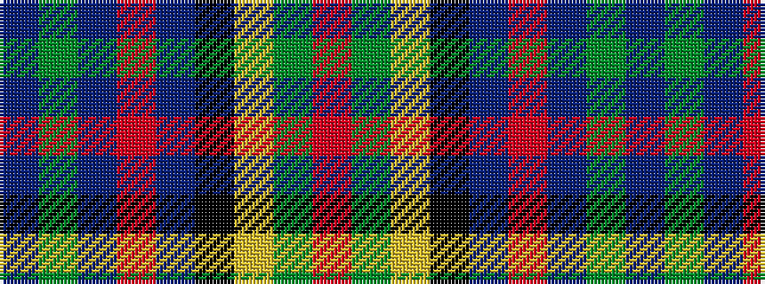

BGBRBKYGR

It is a 9 stripe tartan.

<figure class="pat-woven">

<figcaption>idealised sample</figcaption>
</figure>

## Colour Sequence



## Tartans with this colour sequence

| Tartans |
|---------------|
| [Wilson's, No 33](/setts/s9/db4g17t3r3t3k19ly2g17r4~x2/)|
||
