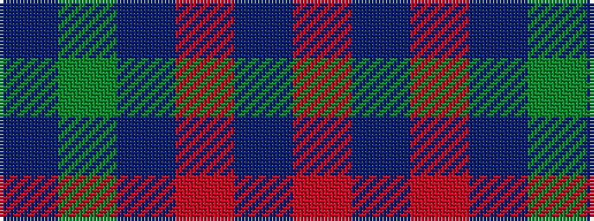

BGBRBR

It is a 6 stripe tartan.

<figure class="pat-woven">

<figcaption>idealised sample</figcaption>
</figure>

## Colour Sequence



## Tartans with this colour sequence

| Tartans |
|---------------|
| [Lynch](/setts/s6/r19db6r7db101dg6db7~x2/)|
||
| [Lynch](/setts/s6/r3db2r1db18g1db2~x4/)|
||
| [Lynch Family Tartan Tartan Number: 2163. Earliest known date: 1994 Information from Dr. Phil Smith, Narvon, USA. See products available Copyright © Blair Urquhart, Comrie, 2015](/setts/s6/r19db6r14db101g7db7/)|
||
| [Lynch Variant](/setts/s6/r12dp3r7dp52dg4dp4~x2/)|
||
