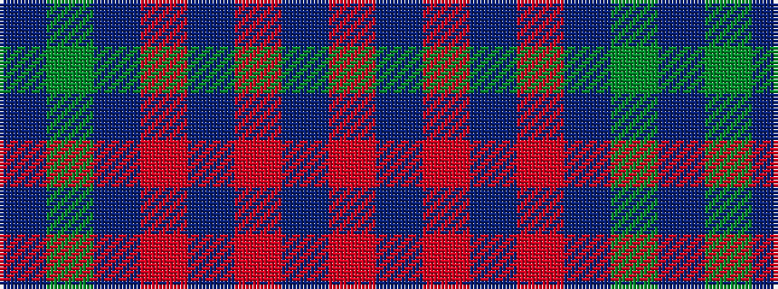

BGBRBRBR

It is a 8 stripe tartan.

<figure class="pat-woven">

<figcaption>idealised sample</figcaption>
</figure>

## Colour Sequence



## Tartans with this colour sequence

| Tartans |
|---------------|
| [Remony (Red)](/setts/s8/r17db2r2db13r2db2g17db2~x2/)|
||
