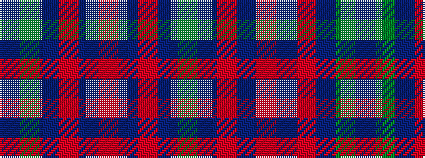

BGBRBRBRBG

It is a 10 stripe tartan.

<figure class="pat-woven">

<figcaption>idealised sample</figcaption>
</figure>

## Colour Sequence



## Tartans with this colour sequence

| Tartans |
|---------------|
| [Hamilton (Personal)](/variants/s10/dg3db21r14db5r14db5r14db18dg3db3~x2/)|
||
