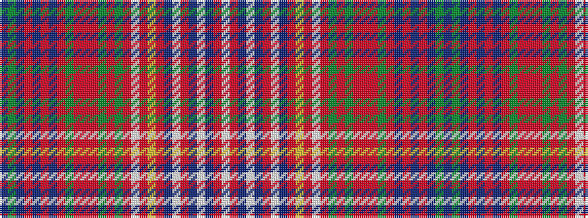

BGBRBRBRGRRRGRGRWRYRBWRBWBRW

It is a 28 stripe tartan.

<figure class="pat-woven">

<figcaption>idealised sample</figcaption>
</figure>

## Colour Sequence



## Tartans with this colour sequence

| Tartans |
|---------------|
| [Unidentified Plaid 15](/setts/s28/w70o7db7w7db7o7w7db5o9ly4o3w4o3g13o70g30o4r10o4g30o15db4o4db4o4db27g6db27~x2/)|
||
