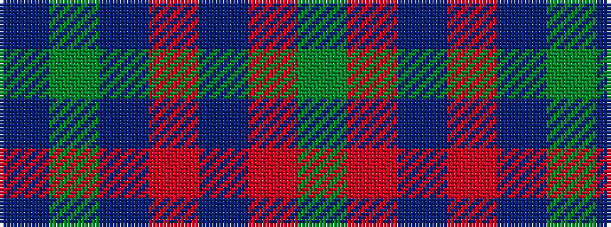

BGBRBRG

It is a 7 stripe tartan.

<figure class="pat-woven">

<figcaption>idealised sample</figcaption>
</figure>

## Colour Sequence



## Tartans with this colour sequence

| Tartans |
|---------------|
| [Fiddes (Corrected)](/setts/s7/g12r11dp12r3dp8g8dp8~x2/)|
||
