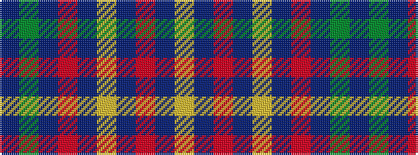

BGBRBYBRBY

It is a 10 stripe tartan.

<figure class="pat-woven">

<figcaption>idealised sample</figcaption>
</figure>

## Colour Sequence



## Tartans with this colour sequence

| Tartans |
|---------------|
| [Unidentified Specimen #3](/setts/s10/db1dg4db1r1db1ly1db5r6db1ly1~x2/)|
||
| [Unidentified, specimen](/setts/s10/db1g4db1r1db1ly1db5r6db1ly1~x2/)|
||
