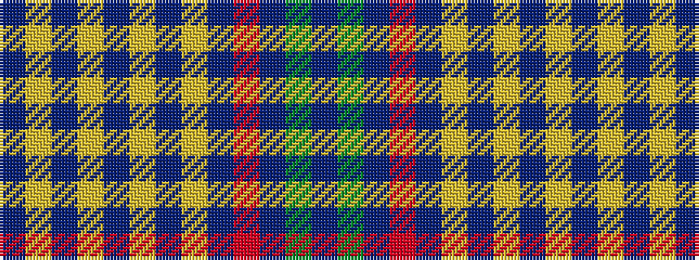

BGBRBYBYBYBYB

It is a 13 stripe tartan.

<figure class="pat-woven">

<figcaption>idealised sample</figcaption>
</figure>

## Colour Sequence



## Tartans with this colour sequence

| Tartans |
|---------------|
| [G8 Summit](/setts/s13/dp4g9db2r2db50lr1db1lr1db1lr1db1lr1db1~x2/)|
||
